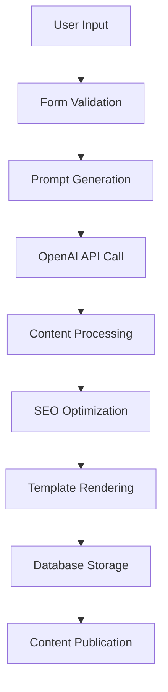

# 🚀 AI Blog Content Generation System

## Overview

Our AI-powered blog content generation system provides users with free, high-quality blog posts that incorporate foundational SEO principles and natural backlink strategies. The system leverages OpenAI's ChatGPT-3.5-turbo model to create professionally crafted content that helps users understand and implement effective search engine optimization (SEO) strategies.

## 🎯 Mission Statement

To democratize access to professional SEO content creation by providing users with free, AI-generated blog posts that demonstrate best practices in search engine optimization and strategic backlink placement.

## ✨ Key Features

### Core Functionality
- **AI-Powered Content Generation**: Utilizes OpenAI ChatGPT-3.5-turbo for high-quality content creation
- **SEO-Optimized Structure**: Automatically implements SEO best practices including proper heading hierarchy, keyword density, and meta optimization
- **Natural Backlink Integration**: Seamlessly incorporates user-specified anchor text and destination URLs
- **Professional Blog Templates**: Multiple premium templates including EliteBlogTemplate with advanced typography and engagement features
- **Real-time Generation**: Instant content creation with live progress tracking

### User Input Requirements
The system captures three essential inputs to generate targeted content:

1. **Target Keyword** - The primary focus topic for SEO optimization
2. **Anchor Text** - The clickable text for hyperlink integration  
3. **Destination URL** - The target destination for the embedded link

## 🔧 Technical Architecture

### Technology Stack
- **Frontend**: React with Vite for optimal development experience
- **Hosting**: Netlify for reliable, scalable deployment
- **Database**: Supabase for robust data management and user accounts
- **AI Engine**: OpenAI ChatGPT-3.5-turbo model
- **Styling**: TailwindCSS with custom CSS for premium blog templates
- **Environment**: Netlify Environment Variables for secure API key management

### API Configuration
```bash
# Required Netlify Environment Variables
OPENAI_API_KEY=your_openai_api_key_here
OPEN_AI_API_KEY=your_openai_api_key_here  # Fallback variable name
```

## 🤖 Content Generation Process

### Prompt Templates
Our system uses three sophisticated prompt patterns, randomly selected for content variety:

1. **Authority Pattern**: 
   ```
   "Create an authoritative expert guide on {{keyword}} that naturally integrates {{anchor_text}} as a valuable resource linking to {{url}}"
   ```

2. **Analysis Pattern**:
   ```
   "Write a comprehensive industry-leading analysis of {{keyword}} featuring {{anchor_text}} as a strategic reference to {{url}}"
   ```

3. **Thought Leadership Pattern**:
   ```
   "Develop a thought leadership piece on {{keyword}} that seamlessly incorporates {{anchor_text}} directing readers to {{url}}"
   ```

### Enhanced Content Requirements
- **Word Count**: 1000+ words of premium, expert-level content
- **Authority Elements**: 3-5 data points, statistics, or case studies
- **Engagement Features**: Psychological triggers, compelling headlines, and social sharing optimization
- **SEO Structure**: Proper H1/H2/H3 hierarchy with semantic HTML
- **Backlink Strategy**: Natural, value-adding link placement

## 🎨 Frontend Experience

### Modern UI/UX Features
- **Elite Blog Template**: Premium typography with animated elements
- **Reading Progress Tracking**: Visual progress bars and engagement metrics
- **Interactive Elements**: Floating quality scores, table of contents, social sharing
- **Responsive Design**: Mobile-first approach with accessibility features
- **Professional Presentation**: Author verification badges and expert indicators

### Blog Template Features
- Animated drop caps with gradient effects
- Enhanced typography with professional font rendering
- Interactive table of contents with smooth scrolling
- Social sharing integration across multiple platforms
- Reading time calculation and engagement analytics
- Print-friendly and accessibility-compliant design

## 🗄️ Backend Architecture

### Content Management System
- **Post Claiming**: Users can claim and manage generated content
- **Content Organization**: Structured database with metadata management
- **User Accounts**: Individual content libraries and history tracking
- **SEO Optimization**: Automated implementation of technical SEO practices

### Database Schema
- **Blog Posts**: Content storage with metadata and SEO data
- **User Management**: Account creation and content association  
- **Analytics**: Engagement tracking and performance metrics
- **Content Moderation**: Quality assurance and spam prevention

## 🚀 Getting Started

### Prerequisites
- Node.js 18+ 
- Netlify account for deployment
- Supabase account for database
- OpenAI API key

### Installation
```bash
# Clone the repository
git clone [repository-url]

# Install dependencies
npm install

# Set up environment variables
# Add OPENAI_API_KEY to Netlify environment variables

# Start development server
npm run dev
```

### Usage
1. Navigate to the blog generation form
2. Enter your target keyword (e.g., "digital marketing")
3. Specify your anchor text (e.g., "professional SEO services")
4. Provide your destination URL (e.g., "https://yoursite.com")
5. Click "Claim Now For Free" to generate content
6. Review and publish your AI-generated blog post

## 📊 System Workflow



### Detailed Process Flow
1. **Input Validation**: Verify all required fields are complete
2. **Prompt Selection**: Choose from three advanced prompt patterns
3. **API Request**: Submit enhanced prompt to OpenAI ChatGPT-3.5-turbo
4. **Content Refinement**: Process and optimize generated content
5. **SEO Implementation**: Apply technical SEO best practices
6. **Template Application**: Render content using EliteBlogTemplate
7. **Database Storage**: Save content with metadata and user association
8. **Publication**: Deploy content with unique URL and sharing capabilities

## 🔒 Security & Reliability

### API Key Management
- Server-side only API key storage via Netlify environment variables
- No client-side exposure of sensitive credentials
- Fallback mechanisms for development environments
- Comprehensive error handling and logging

### Content Quality Assurance
- Built-in content moderation and quality scoring
- Spam detection and prevention mechanisms
- User content ownership and management controls
- Automated SEO compliance checking

## 📈 Performance Features

### Optimization Elements
- **Load Time**: Optimized asset loading and code splitting
- **SEO Score**: Automated technical SEO implementation
- **User Experience**: Smooth animations and responsive design
- **Accessibility**: WCAG compliance and screen reader support
- **Analytics**: Built-in engagement tracking and performance metrics

### Content Quality Metrics
- Reading time calculation and optimization
- Keyword density analysis and optimization
- Content structure validation
- Social sharing potential assessment
- Engagement prediction scoring

## 🛠️ Development Guidelines

### Code Standards
- TypeScript for type safety and developer experience
- ESLint and Prettier for code consistency
- Component-based architecture with reusable UI elements
- Comprehensive error handling and user feedback
- Performance monitoring and optimization

### Testing Approach
- API endpoint testing for content generation
- Component testing for UI reliability
- Integration testing for user workflows
- Performance testing for load optimization
- SEO testing for search engine compliance

## 🔄 System Monitoring

### Health Checks
- API connectivity verification
- Content generation success rates
- User engagement analytics
- System performance monitoring
- Error tracking and resolution

### Quality Assurance
- Automated content quality scoring
- SEO compliance verification
- User satisfaction tracking
- Content uniqueness validation
- Performance optimization monitoring

## 📞 Support & Maintenance

### Issue Resolution
- Comprehensive error logging and tracking
- User feedback collection and analysis
- Performance monitoring and optimization
- Security vulnerability assessment
- Regular system updates and improvements

### Future Enhancements
- Advanced AI model integration
- Enhanced content customization options
- Improved SEO analytics and reporting
- Extended template library
- Advanced user management features

## 📜 License & Usage

This system is designed for educational and professional use in understanding SEO best practices and content creation strategies. Users retain ownership of generated content while respecting platform terms of service.

---

**Built with ❤️ by the Backlink ∞ Team**

*Empowering users with professional SEO content generation and natural backlink strategies.*
