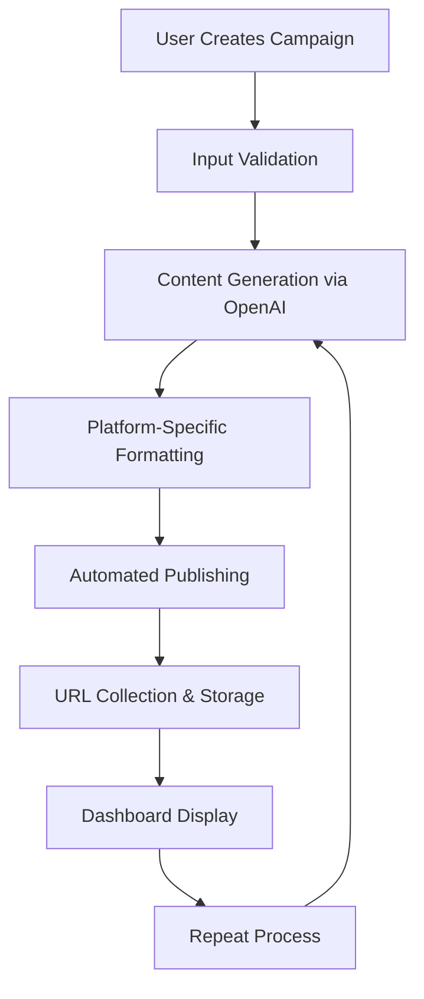

# Backlink Automation System

A comprehensive link-building automation platform that generates high-quality content with embedded backlinks and publishes them across multiple high-authority platforms.

## 🎯 Overview

The Backlink Automation System enables users to create automated campaigns that generate contextually relevant content and publish it across various platforms to build high-quality backlinks for improved SEO performance.

## 🚀 How It Works

### User Campaign Creation

Users create campaigns by providing three key inputs:

1. **Target URL** - The destination website or domain they want to rank
2. **Keyword** - The term used to generate contextually relevant content  
3. **Anchor Text** - The clickable text that links to the target URL, strategically embedded within content

### Automated Workflow



## 🔄 Technical Process

### 1. Campaign Initialization
- User submits campaign form with required inputs
- System validates URL format and input completeness
- Campaign record created in database with unique ID

### 2. Content Generation
- User inputs fed into custom OpenAI prompt template
- ChatGPT/GPT-4 generates high-quality, contextually relevant content
- Content follows SEO best practices for maximum effectiveness
- Anchor text strategically placed using proper grammar and natural flow

### 3. Platform Integration
- Generated content formatted for each target publishing platform
- Platform-specific API requirements handled automatically
- Content adapted to meet each platform's guidelines and formatting

### 4. Automated Publishing
- Content published via API endpoints or programmed integrations
- Multiple platforms targeted simultaneously for maximum reach
- Error handling and retry logic for failed publications

### 5. URL Collection & Tracking
- Published URLs (postback URLs) collected automatically
- Links stored in user dashboard for monitoring and reporting
- Campaign progress tracked in real-time

### 6. Continuous Operation
- Process repeats automatically for ongoing campaigns
- New content variations generated for different platforms
- Campaign performance monitored and optimized

## 🌐 Publishing Platforms

### Currently Active
- **Telegraph.ph** (DR 91) - High-authority publishing platform

### Coming Soon
- **Medium.com** (DR 96) - Professional publishing platform
- **Dev.to** (DR 86) - Developer community
- **LinkedIn** (DR 100) - Professional articles
- **Hashnode** (DR 75) - Developer blogging
- **Substack** (DR 88) - Newsletter platform

## 🎨 User Interface

### Campaign Creation Form
- **Progress Indicator** - Visual feedback on form completion
- **Auto-formatting** - Automatic URL formatting (adds https://)
- **Real-time Validation** - Instant feedback on input quality
- **Smart Suggestions** - Contextual help and optimization tips

### Dashboard Features
- **Live Monitoring** - Real-time campaign progress tracking
- **Activity Feed** - Live updates on content generation and publishing
- **Link Management** - Centralized view of all published backlinks
- **Performance Metrics** - Campaign success tracking and analytics

## 🔧 Technical Architecture

### Frontend Stack
- **React 18** with TypeScript
- **Tailwind CSS** for styling
- **shadcn/ui** component library
- **React Router** for navigation
- **React Hook Form** for form management

### Backend Services
- **Supabase** for database and real-time features
- **Netlify Functions** for serverless API endpoints
- **OpenAI API** for content generation
- **Custom orchestration services** for workflow management

### Key Services

#### Automation Orchestrator
```typescript
// Central service coordinating campaign lifecycle
getOrchestrator().createCampaign({
  target_url: string,
  keyword: string,
  anchor_text: string
})
```

#### Content Generation Service
```typescript
// OpenAI integration for content creation
generateContent({
  keyword: string,
  targetUrl: string,
  anchorText: string,
  platform: string
})
```

#### Publishing Services
```typescript
// Platform-specific publishing handlers
publishToTelegraph(content: FormattedContent)
publishToMedium(content: FormattedContent)
// ... additional platforms
```

## 📊 Features

### Campaign Management
- ✅ **Multi-platform Publishing** - Simultaneous content distribution
- ✅ **Real-time Monitoring** - Live campaign progress tracking
- ✅ **Automated Retry Logic** - Handles publication failures gracefully
- ✅ **Content Variation** - Generates unique content for each platform
- ✅ **URL Validation** - Ensures target URLs are properly formatted

### Content Quality
- ✅ **SEO Optimization** - Content follows best practices
- ✅ **Natural Language** - AI-generated content reads naturally
- ✅ **Contextual Relevance** - Content matches target keywords
- ✅ **Proper Grammar** - Anchor text integrated seamlessly

### User Experience
- ✅ **Intuitive Interface** - Clean, modern design
- ✅ **Progress Feedback** - Visual indicators for all actions
- ✅ **Responsive Design** - Works on desktop and mobile
- ✅ **Auto-save Forms** - Preserves user input across sessions

## 🚦 Campaign Lifecycle

### 1. Creation Phase
- Form validation and submission
- Campaign record initialization
- User authentication verification

### 2. Generation Phase
- Content creation via OpenAI
- Platform-specific formatting
- Quality assurance checks

### 3. Publishing Phase
- Multi-platform content distribution
- Error handling and retries
- Success confirmation

### 4. Monitoring Phase
- Real-time progress tracking
- URL collection and storage
- Performance analytics

### 5. Completion Phase
- Campaign status updates
- Final reporting
- Link archive creation

## 🔐 Security & Authentication

- **Supabase Auth** - Secure user authentication
- **API Key Management** - Encrypted storage of service credentials
- **Input Sanitization** - Protection against malicious inputs
- **Rate Limiting** - Prevents abuse and ensures fair usage

## 📈 Analytics & Reporting

### Campaign Metrics
- Publication success rates
- Platform performance comparison
- Content generation times
- Error tracking and resolution

### User Dashboard
- Active campaign overview
- Historical campaign data
- Published link inventory
- Performance insights

## 🛠️ Development

### Setup Requirements
```bash
# Install dependencies
npm install

# Environment variables
VITE_SUPABASE_URL=your_supabase_url
VITE_SUPABASE_ANON_KEY=your_supabase_key
OPENAI_API_KEY=your_openai_key

# Development server
npm run dev
```

### Key Components
- `Automation.tsx` - Main campaign creation interface
- `CampaignManagerTabbed.tsx` - Campaign monitoring dashboard
- `InlineFeedMonitor.tsx` - Real-time activity feed
- `automationOrchestrator.ts` - Core workflow management

## 🎯 Future Enhancements

### Platform Expansion
- Additional high-DR publishing platforms
- Custom platform integration framework
- WordPress plugin integration

### AI Improvements
- Content personalization based on platform
- Automated A/B testing of content variations
- Advanced SEO optimization algorithms

### Analytics Enhancement
- Detailed performance tracking
- ROI calculation and reporting
- Competitive analysis tools

## 📞 Support

For technical issues or questions about the backlink automation system:
- Check the troubleshooting section in the dashboard
- Review campaign error logs for specific issues
- Contact support through the platform interface

---

**Note**: This system is designed for legitimate SEO practices. Users are responsible for ensuring their campaigns comply with target platform guidelines and applicable laws.
